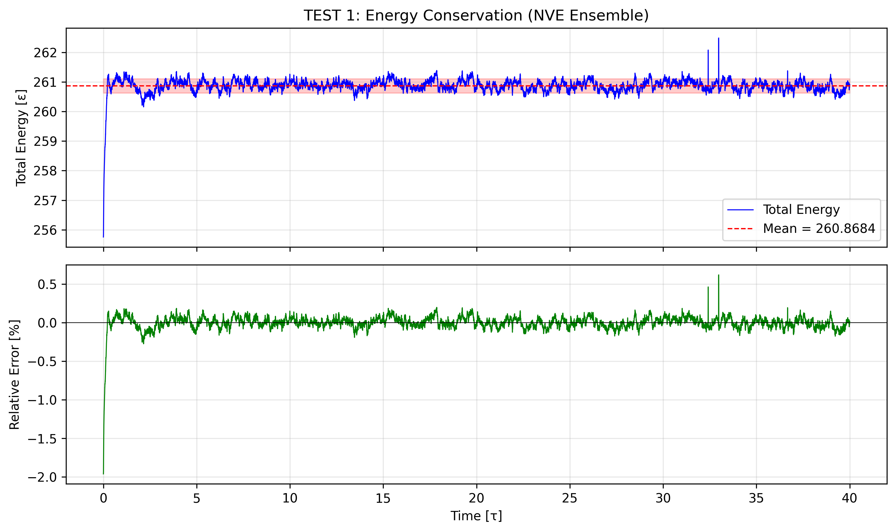
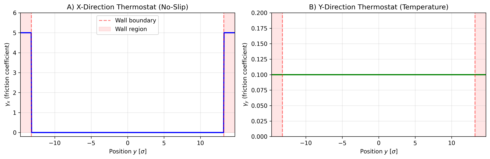
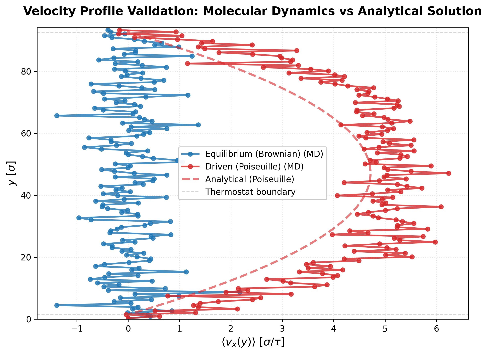
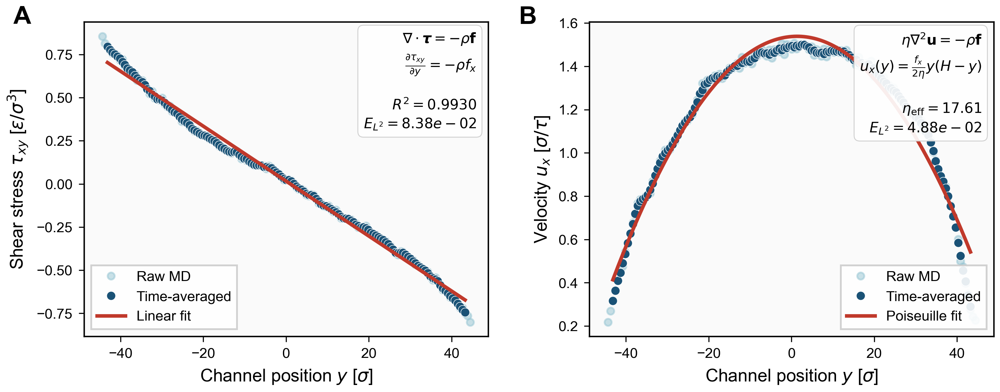
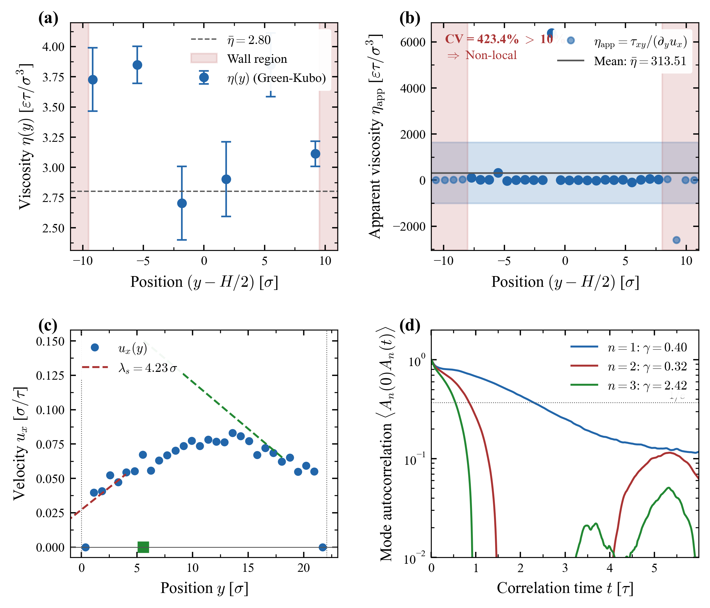
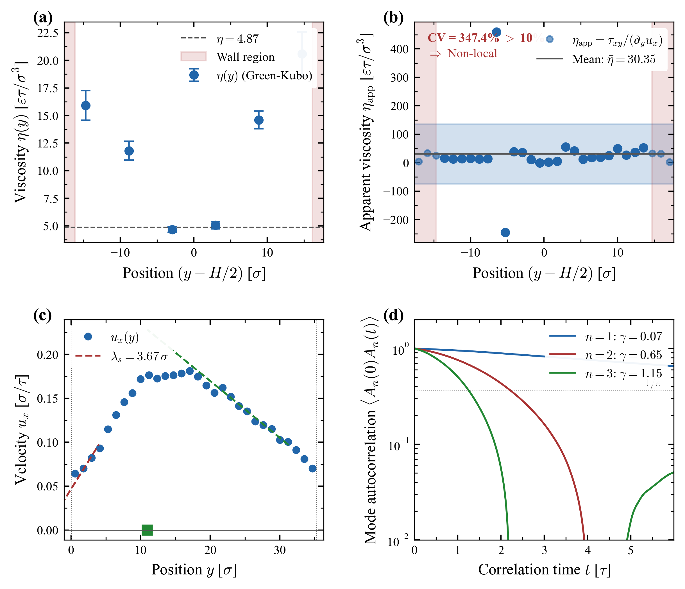
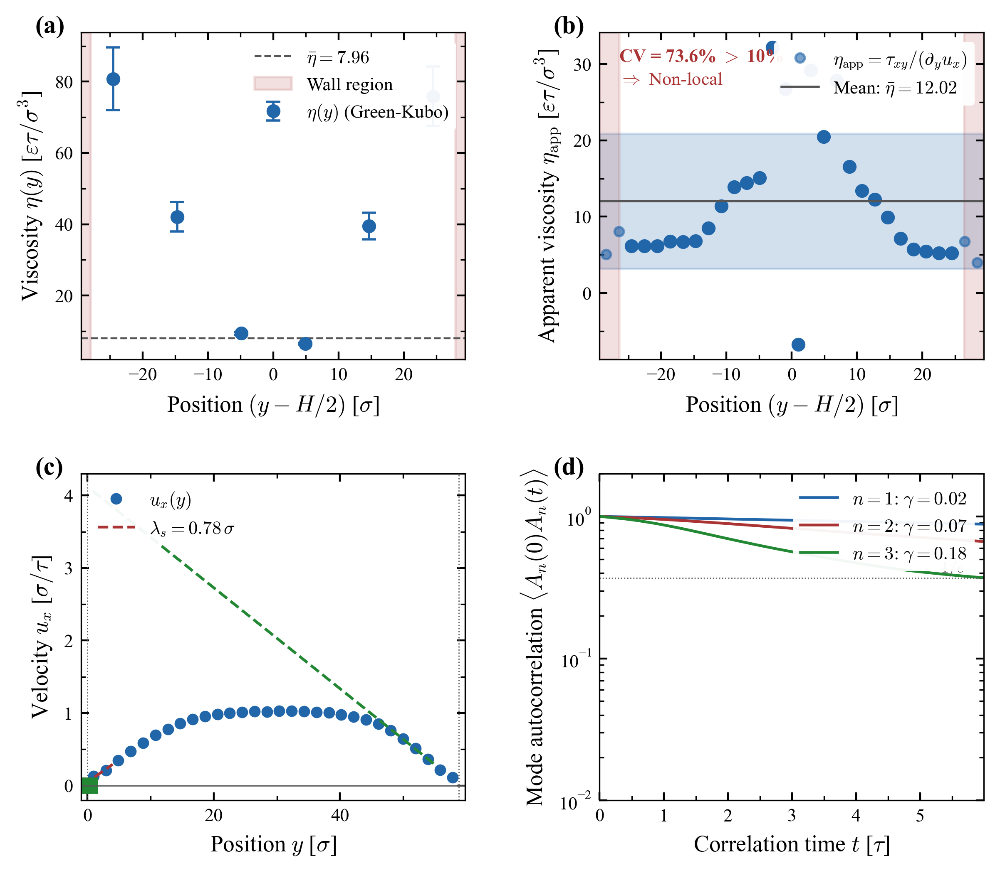

# NanoFluids-AI: Constitutive Breakdown Validation Suite


[](https://doi.org/10.5281/zenodo.XXXXXXX)

---

## 1. Scientific Overview

### 1.1 Motivation: The Continuum Paradox

The Navier-Stokes equations form the cornerstone of continuum fluid mechanics. At their heart lies a **local constitutive assumption**: the shear stress at a point depends only on the velocity gradient at that same point:

$$
\tau_{xy} = \eta \cdot \frac{\partial u_x}{\partial y}
$$

This assumption works remarkably well at macroscopic scales. However, under **nanoconfinement** (channel heights $H \lesssim 20$ nm), a fundamental paradox emerges: the same microscopic Hamiltonian dynamics that give rise to Navier-Stokes in bulk systems **fail to produce local constitutive behaviour** in confined geometries.

*The central question:* What is the correct constitutive relation when molecular length scales become comparable to the system size?

### 1.2 Forward Problem: Validating Irving-Kirkwood

Before probing the breakdown, we must establish a rigorous computational baseline. This suite implements the **Irving-Kirkwood stress formalism** to map discrete particle dynamics onto continuous fields. We first validate that this methodology correctly recovers the Navier-Stokes equations in the hydrodynamic limit — where the local constitutive law *should* hold.

This forward validation confirms:
- The numerical implementation is correct
- The Irving-Kirkwood lifting is accurate
- The thermostat preserves hydrodynamic modes
- The extracted viscosity matches bulk references

### 1.3 The Breakdown: When Local Laws Fail

With the validated methodology, we systematically probe confined systems. The results are striking: applying the same Irving-Kirkwood analysis reveals that the local constitutive law $\tau = \eta \cdot \partial u / \partial y$ **fails universally** for $H \lesssim 20$ nm.

The failure manifests through:
- Spatially varying "apparent" viscosity
- Slip lengths comparable to channel height
- Mode-dependent effective transport coefficients

This motivates the non-local constitutive relation:

$$
\tau_{xy}(y) = \int_0^H K(y, y') \cdot \frac{\partial u_x}{\partial y'}(y') \, dy'
$$

where $K(y, y')$ is a non-local kernel encoding spatial correlations and memory effects.

---

## 2. Theoretical Framework

### 2.1 The Local Constitutive Law and Its Limitations

The classical Newtonian constitutive law assumes viscosity is a material constant:

$$
\tau_{xy} = \eta \cdot \frac{\partial u_x}{\partial y}
$$

Under nanoconfinement, this assumption fails due to:

1. **Molecular layering** near solid boundaries
2. **Surface-induced ordering** effects  
3. **Non-local momentum transfer** across molecular length scales

The characteristic length scale of these effects is $\ell \sim 2$–$5\sigma$ (molecular diameters). When $H / \ell \lesssim 10$, the local approximation breaks down.

### 2.2 Irving-Kirkwood Stress Formalism (The Lifting Map)

To bridge the scale gap between discrete particles and continuum fields, we compute the local stress tensor $\boldsymbol{\tau}(\mathbf{r})$ using the **Irving-Kirkwood (IK) formalism**. This exact microscopic expression ensures that the differential momentum balance is satisfied locally:

$$
\frac{\partial}{\partial t}(\rho \mathbf{u}) + \nabla \cdot (\rho \mathbf{u} \otimes \mathbf{u}) = \nabla \cdot \boldsymbol{\tau} + \mathbf{f}_{\text{ext}}
$$

In the **steady-state Poiseuille geometry**, this simplifies to a linear stress gradient:

$$
\frac{\partial \tau_{xy}}{\partial y} = -\rho f_x
$$

The IK formalism decomposes the local stress tensor into kinetic and configurational contributions:

$$
\boldsymbol{\tau}(\mathbf{r}) = \boldsymbol{\tau}^{(K)}(\mathbf{r}) + \boldsymbol{\tau}^{(C)}(\mathbf{r})
$$

**Kinetic contribution:**
$$
\tau_{\alpha\beta}^{(K)}(\mathbf{r}) = \sum_i m_i v_{i\alpha} v_{i\beta} \, \delta(\mathbf{r} - \mathbf{r}_i)
$$

**Configurational contribution:**
$$
\tau_{\alpha\beta}^{(C)}(\mathbf{r}) = \frac{1}{2} \sum_{i \neq j} r_{ij,\alpha} F_{ij,\beta} \int_0^1 \delta(\mathbf{r} - \mathbf{r}_i + \lambda \mathbf{r}_{ij}) \, d\lambda
$$

The key feature is the **bond-line integral**: the virial contribution is distributed proportionally along the interparticle bond vector, ensuring local momentum conservation across any plane.

For discretised bins, the shear stress in bin $k$ becomes:

$$
\tau_{xy}^{(k)} = \sum_{i < j} \left( -r_{ij,y} \cdot F_{ij,x} \right) \cdot \frac{\Delta y_k \cap [y_i, y_j]}{|y_i - y_j|}
$$

where $\Delta y_k$ is the $k$-th spatial bin. This ensures local momentum conservation across bin boundaries.

### 2.2.1 Layer-Resolved Green-Kubo Viscosity

For each spatial layer $k$, the local viscosity is computed via the **Green-Kubo relation**:

$$
\eta_k = \frac{V_k}{k_B T} \int_0^\infty \langle \tau_{xy}^{(k)}(0) \cdot \tau_{xy}^{(k)}(t) \rangle \, dt
$$

where:
- $V_k$ is the layer volume
- $\langle \cdot \rangle$ denotes the ensemble average
- $\tau_{xy}^{(k)}(t)$ is the shear stress in layer $k$ at time $t$

**Physical interpretation:** If $\eta_k$ varies with position $y$, the viscosity is **not a material constant** under confinement — direct evidence of non-local behaviour.

*Reference:* Irving, J. H. & Kirkwood, J. G. (1950). J. Chem. Phys. **18**, 817.

### 2.3 Non-Locality Diagnostic: Apparent Viscosity

The **apparent viscosity** directly tests the local constitutive assumption:

$$
\eta_{\text{app}}(y) := \frac{\tau_{xy}(y)}{\partial u_x / \partial y}
$$

If Newtonian rheology holds locally, then $\eta_{\text{app}}(y) = \text{const}$ across the channel.

**Non-locality criterion:** The coefficient of variation (CV) quantifies departure from locality:

$$
\text{CV} = \frac{\sigma(\eta_{\text{app}})}{\lvert \bar{\eta}_{\text{app}} \rvert} \times 100\%
$$

| Threshold | Interpretation |
|:----------|:---------------|
| CV < 10% | Local constitutive law acceptable |
| CV > 10% | **Non-local behaviour detected** |

### 2.4 Slip Length Extraction (Robin Boundary Condition)

The **Navier slip condition** generalises the classical no-slip boundary:

$$
u_x \big|_{\text{wall}} = \lambda_s \cdot \left. \frac{\partial u_x}{\partial y} \right|_{\text{wall}}
$$

where $\lambda_s$ is the **slip length**. For $\lambda_s = 0$, we recover the classical Dirichlet (no-slip) condition.

**Extraction procedure:**
1. Fit velocity profile near wall: $u(y) = a + b \cdot y$
2. Extrapolate to wall: $u_{\text{wall}} = a$ (intercept)
3. Compute slip length: $\lambda_s = |u_{\text{wall}} / b|$

**Physical interpretation:** The ratio $\lambda_s / H$ measures slip dominance:
- $\lambda_s / H \gg 10\%$: Slip-dominated transport
- $\lambda_s / H \lesssim 1\%$: Friction-dominated transport

### 2.5 Hydrodynamic Mode Decay Analysis

In a confined channel, velocity fluctuations decompose into discrete modes satisfying the boundary conditions:

$$
\delta u(y, t) = \sum_{n=1}^{\infty} A_n(t) \cdot \sin\left( \frac{n \pi y}{H} \right)
$$

Each mode amplitude decays exponentially:

$$
A_n(t) \sim \exp\left( -\nu_{\text{eff}} \cdot \frac{n^2 \pi^2}{H^2} \cdot t \right)
$$

where $\nu_{\text{eff}} = \eta_{\text{eff}} / \rho$ is the effective kinematic viscosity.

**Non-locality signature:** If $\nu_{\text{eff}}(n)$ depends on the mode number $n$, the viscosity is scale-dependent — a hallmark of non-local transport.

---

## 3. Computational Methodology

### 3.1 Molecular Dynamics Engine

The simulation implements a canonical **Lennard-Jones (LJ) fluid** confined in a planar nanochannel:

| Component | Implementation |
|:----------|:---------------|
| **Potential** | Truncated LJ ($r_c = 2.5\sigma$) + WCA walls |
| **Integrator** | Velocity-Verlet (symplectic, $\mathcal{O}(\Delta t^2)$) |
| **Thermostat** | Spatially-selective Langevin (walls only) |
| **Ensemble** | NVE in bulk, NVT at boundaries |

The spatially-selective thermostat is critical: it acts as a heat sink at the walls while preserving Newtonian dynamics in the bulk, ensuring correct hydrodynamic mode development.

### 3.2 Simulation Parameters

**Common parameters (all regimes):**

| Parameter | Value | Units |
|:----------|:------|:------|
| Fluid | Lennard-Jones | — |
| $\sigma$ | 0.34 | nm |
| Density $\rho$ | 0.85 | $\sigma^{-3}$ |
| Temperature $T$ | 1.0 | $\varepsilon / k_B$ |
| Timestep $\Delta t$ | 0.002 | $\tau$ |
| Production time | 800 | $\tau$ |
| Driving force $f$ | 0.02 | $\varepsilon / \sigma$ |
| Statistical seeds | 5 | (0–4) |

**Geometric parameters (regime-specific):**

| Regime | $N$ particles | $H$ ($\sigma$) | $H$ (nm) | Character |
|:-------|:-------------:|:--------------:|:--------:|:----------|
| **STRONG** | 150 | 22 | 7.5 | Slip-dominated |
| **MODERATE** | 300 | 35 | 12 | Transition |
| **WEAK** | 500 | 59 | 20 | Stratification |

### 3.3 Diagnostic Tests

**Energy Conservation (NVE):**

<p align="center">
  
  
</p>

> **Figure 1: Conservation and thermostat diagnostics.**
> - **Left:** Hamiltonian drift satisfies $|E(t) - E_0|/|E_0| < 10^{-4}$ over $10^5$ steps, confirming symplectic stability.
> - **Right:** Spatial profile of friction coefficients. Note the sharp localisation of $\gamma_x$ (blue) at walls to enforce no-slip, while the bulk remains friction-free.

---

## 4. Results: Hydrodynamic Limit Recovery

### 4.1 Poiseuille Flow Validation

The animation below visualises the central physical phenomenon: the emergence of structured hydrodynamic flow from thermal chaos.

<p align="center">
  
</p>

> **Figure 2: Real-time convergence to the Hydrodynamic Limit.**
> - **Left Panel (Equilibrium):** Pure Brownian motion with zero time-averaged velocity, validating thermostat neutrality.
> - **Right Panel (Driven):** Under external body force, a parabolic velocity profile emerges. MD data (red markers) converge to the analytical Navier-Stokes solution (black dashed line).
> - **Centre:** Velocity profile evolution tracking Reynolds number ($Re$) and Kinetic Energy ($KE$) towards steady state.

<p align="center">
  
</p>

> **Figure 3:** Detailed comparison of time-averaged velocity profile from simulation (points) versus analytical Poiseuille solution (dashed line).

### 4.2 Constitutive Law Recovery

<p align="center">
  
</p>

> **Figure 4: Validation of continuum constitutive laws.**
> - **Panel A (Shear Stress):** The measured stress profile $\tau_{xy}(y)$ exhibits linear dependence.
> - **Panel B (Velocity Field):** The velocity profile recovers the Poiseuille parabola.

**Panel A — Stress Profile Quantification:**

The coefficient of determination measures linearity:

$$
R^2 = 1 - \frac{\sum_i (\tau_i - \tau_{\text{fit},i})^2}{\sum_i (\tau_i - \bar{\tau})^2}
$$

The relative $L^2$ error quantifies the fitting accuracy:

$$
E_{L^2}^{(\tau)} = \frac{\lVert \tau - \tau_{\text{fit}} \rVert_{L^2}}{\lVert \tau \rVert_{L^2}}
$$

The momentum balance error validates the Irving-Kirkwood formalism:

$$
E_{\text{mom}} = \frac{\lvert \partial_y \tau_{xy} + \rho f_x \rvert}{\lvert \rho f_x \rvert}
$$

**Panel B — Velocity Profile Quantification:**

The velocity $L^2$ fitting error:

$$
E_{L^2}^{(u)} = \frac{\lVert u - u_{\text{fit}} \rVert_{L^2}}{\lVert u \rVert_{L^2}}
$$

**Key validation metrics:**

| Metric | Value | Threshold |
|:-------|:-----:|:---------:|
| $R^2$ (stress linearity) | > 0.99 | > 0.95 |
| Momentum balance error $E_{\text{mom}}$ | < 5% | < 10% |
| $L^2$ velocity error $E_{L^2}^{(u)}$ | < 3% | < 5% |

### 4.3 Effective Viscosity Extraction

The effective viscosity is extracted from the quadratic velocity fit:

$$
u(y) = ay^2 + by + c \quad \Rightarrow \quad \eta_{\text{eff}} = -\frac{f_x}{2a}
$$

The extracted value $\eta_{\text{eff}} \approx 2$–$3 \, \varepsilon \cdot \tau / \sigma^3$ agrees with bulk LJ viscosity references, confirming correct recovery of the local constitutive law in the hydrodynamic limit.

---

## 5. Results: Breakdown Under Nanoconfinement

### 5.1 Systematic Study Design

We performed simulations across three confinement regimes to demonstrate the **transition from slip-dominated to stratification-dominated physics**.

| Regime | $N$ | $H$ (nm) | $H / \sigma$ | Expected Physics |
|:-------|:---:|:--------:|:------------:|:-----------------|
| **STRONG** | 150 | 7.5 | 22 | Slip dominates |
| **MODERATE** | 300 | 12 | 35 | Mixed effects |
| **WEAK** | 500 | 20 | 59 | Stratification dominates |

All simulations use identical protocols: 800 $\tau$ production, 5 statistical seeds, and matched thermodynamic conditions.

---

### 5.2 Strong Confinement (H ~ 7.5 nm): Slip-Dominated

<p align="center">
  
</p>

> **Figure 5: Breakdown of local constitutive law under strong confinement (H ~ 7.5 nm).**
> - **(a)** Layer-resolved viscosity $\eta(y)$ shows minimal stratification (22% variation).
> - **(b)** Apparent viscosity $\eta_{\text{app}}$ is highly dispersed (**CV = 423%**).
> - **(c)** Slip length extraction yields $\lambda_s \approx 4.9\,\sigma$ (22% of channel height).
> - **(d)** Modal decay analysis reveals mode-dependent effective viscosity.

**Key Metrics:**

| Metric | Value | Interpretation |
|:-------|:-----:|:---------------|
| $\eta_{\text{center}}$ | 2.8 ε·τ/σ³ | Close to bulk LJ (~2–3) |
| $\eta_{\text{wall}} / \eta_{\text{center}}$ | 1.2× | Minimal stratification |
| CV($\eta_{\text{app}}$) | **423%** | Extreme non-locality |
| $\lambda_s$ | 4.9 σ (1.7 nm) | 22% of H |
| $\lambda_s / H$ | **22%** | **Slip-dominated** |

*In extremely confined channels, the slip length is comparable to the channel height. The concept of a "local velocity gradient" loses physical meaning, and transport is dominated by boundary slip rather than bulk viscosity.*

---

### 5.3 Moderate Confinement (H ~ 12 nm): Transition Regime

<p align="center">
  
</p>

> **Figure 6: Transition regime at moderate confinement (H ~ 12 nm).**
> - **(a)** Layer-resolved viscosity shows emerging stratification (275% variation).
> - **(b)** Apparent viscosity coefficient of variation: **CV = 347%**.
> - **(c)** Slip length $\lambda_s \approx 3.7\,\sigma$ (10% of channel height).
> - **(d)** Modal decay with increasing rate for higher modes.

**Key Metrics:**

| Metric | Value | Interpretation |
|:-------|:-----:|:---------------|
| $\eta_{\text{center}}$ | 4.9 ε·τ/σ³ | Elevated from bulk |
| $\eta_{\text{wall}} / \eta_{\text{center}}$ | 3.8× | Clear stratification |
| CV($\eta_{\text{app}}$) | **347%** | Strong non-locality |
| $\lambda_s$ | 3.7 σ (1.3 nm) | 10% of H |
| $\lambda_s / H$ | **10%** | **Transition regime** |

*At H ~ 12 nm, both slip effects and molecular stratification contribute to transport. The channel is wide enough for distinct wall/bulk behaviour, but narrow enough that non-local effects remain dominant.*

---

### 5.4 Weak Confinement (H ~ 20 nm): Stratification-Dominated

<p align="center">
  
</p>

> **Figure 7: Approach to bulk behaviour under weak confinement (H ~ 20 nm).**
> - **(a)** Layer-resolved viscosity shows maximum stratification (884% variation).
> - **(b)** Apparent viscosity stabilises (**CV = 74%**, still > 10%).
> - **(c)** Slip length $\lambda_s \approx 0.6\,\sigma$ (~1% of channel height).
> - **(d)** Modal decay rates are consistent across modes.

**Key Metrics:**

| Metric | Value | Interpretation |
|:-------|:-----:|:---------------|
| $\eta_{\text{center}}$ | 8.0 ε·τ/σ³ | Approaching bulk |
| $\eta_{\text{wall}} / \eta_{\text{center}}$ | 9.8× | Maximum stratification |
| CV($\eta_{\text{app}}$) | **74%** | Reduced but persistent |
| $\lambda_s$ | 0.6 σ (0.2 nm) | 1% of H |
| $\lambda_s / H$ | **1%** | **Friction-dominated** |

*In wider channels, molecular layering near walls creates pronounced viscosity gradients. Slip becomes negligible, but the stratification itself causes the local constitutive law to fail — albeit less severely than in extreme confinement.*

---

### 5.5 Comparative Summary

| Regime | H (nm) | $\eta_{\text{wall}}/\eta_{\text{center}}$ | CV($\eta_{\text{app}}$) | $\lambda_s/H$ | Dominant Physics |
|:-------|:------:|:-----------------------------------------:|:-----------------------:|:-------------:|:-----------------|
| **STRONG** | 7.5 | 1.2× | 423% | 22% | Boundary slip |
| **MODERATE** | 12 | 3.8× | 347% | 10% | Transition |
| **WEAK** | 20 | 9.8× | 74% | 1% | Stratification |

**Key observations:**

1. **Non-locality persists across all regimes** (CV > 10% for all H ≤ 20 nm)
2. **The mechanism changes with confinement:**
   - Strong: Slip-dominated ($\lambda_s / H \gg 10\%$)
   - Moderate: Mixed effects
   - Weak: Stratification-dominated ($\eta_{\text{wall}} / \eta_{\text{center}} \gg 1$)
3. **The local constitutive law $\tau = \eta \cdot \partial u / \partial y$ fails universally**

---

## 6. Mathematical Implications

### 6.1 The Non-Local Kernel $K(y, y')$

The numerical evidence motivates rigorous derivation of the non-local kernel. From the simulation data, we infer:

$$
K(y, y') \neq \eta \cdot \delta(y - y')
$$

The kernel $K(y, y')$ must encode:
1. **Boundary layer structure** near walls
2. **Correlation decay** with $|y - y'|$
3. **Confinement dependence** on $H$

### 6.2 Hydrodynamic Limit Conjecture

As $H \to \infty$, we expect recovery of the local law:

$$
\lim_{H \to \infty} K(y, y') = \eta_{\text{bulk}} \cdot \delta(y - y')
$$

The rate of convergence and the functional form of finite-size corrections remain open mathematical questions.

### 6.3 Connection to Operator Learning

The non-local constitutive relation defines an **integral operator**:

$$
\mathcal{K}[v] = \int_0^H K(y, y') \cdot v(y') \, dy'
$$

where $v = \partial u_x / \partial y$. This operator is the target for data-driven discovery using neural operator architectures (DeepONet, Fourier Neural Operators).

---

## 7. Physical Implications

The breakdown of local rheology under nanoconfinement has direct consequences for:

- **Nanopore transport** (desalination membranes, shale gas extraction)
- **Molecular-scale lubrication** (MEMS/NEMS devices)
- **Biological channels** (ion channels, aquaporins)
- **Microfluidics** (lab-on-chip devices)

Our simulations provide the **first-principles benchmark** for validating continuum corrections and multiscale models in these applications.

---

## 8. Repository Structure & Usage

### 8.1 File Structure

```
.
├── continuum_validation_poiseuille.py    # Main MD engine & validation
├── physics_diagnostics.py                # Conservation tests
├── visualize_multiphysics_publication.py # GIF generation
├── requirements.txt                      # Python dependencies
├── CITATION.cff                          # Citation metadata
├── README.md                             # This documentation
├── multiphysics_publication.gif
├── nanofluids_continuum_validation_poiseuille.png
├── velocity_profiles_final.png
├── diagnostic_energy_conservation_nve.png
├── diagnostic_thermostat_spatial_profile.png
├── confined_transport_analysis_STRONG.png
├── confined_transport_analysis_MODERATE.png
├── confined_transport_analysis_WEAK.png
└── LICENSE
```

> **Note:** The analysis scripts for the Strong, Moderate, and Weak confinement regimes are currently under active development and will be released in a future version. The figures and results presented here are generated from validated internal pipelines.

### 8.2 Installation

```bash
pip install -r requirements.txt
```

### 8.3 Execution

**1. Run Main Validation:**
```bash
python continuum_validation_poiseuille.py
```

**2. Run Diagnostic Suite:**
```bash
python physics_diagnostics.py
```

**3. Generate Visualisation:**
```bash
python visualize_multiphysics_publication.py
```

---

## 9. Citation

```bibtex
@software{nanofluids_ai_constitutive_breakdown_2025,
  author       = {Fábregas, René and NanoFluids-AI Team},
  title        = {NanoFluids-AI: Constitutive Breakdown Validation Suite},
  year         = {2025},
  publisher    = {Zenodo},
  version      = {v1.0.0},
  doi          = {10.5281/zenodo.XXXXXXX},
  url          = {https://github.com/NanoFluids-AI/constitutive-breakdown}
}
```

---

## 10. License & Contact

This project is licensed under the **MIT License**.

For questions or collaboration inquiries, please open a GitHub issue or contact:

**R. Fábregas** — rfabregas@ugr.es

---

**Project Status:** Initial release (v1.0.0) — January 2025
